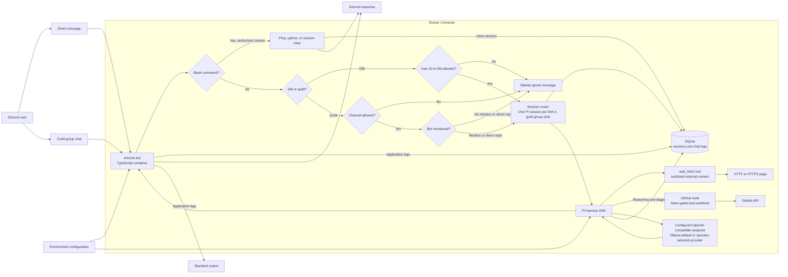

# Artemis Discord Bot Design

Status: Implemented baseline

Source: [HSV-AI/artemis issue #1](https://github.com/HSV-AI/artemis/issues/1)

Last updated: 2026-08-22

## Summary

Artemis is a community-run Discord bot that supports AI-assisted conversations in direct messages and selected guild chats. The current application allows configured users to converse with the model in DMs and any user to converse in configured channels across guilds, exposes context-aware `/ping`, `/uptime`, and `/clear-session` commands, and preserves each chat's context across restarts until an authorized user starts a fresh session.

The implementation uses PI and the PI SDK as the conversational harness, SQLite for durable sessions and chat logs, and Docker Compose for local operation. The existing Ollama-backed workflow remains the default; an optional operator-provided JSON file selects another OpenAI-compatible provider. Environment configuration and credentials are supplied through an uncommitted `.env` file. [Configurable model provider](model-provider.md) owns the detailed provider and web-fetch contract.

## Design document map

Detailed protocols and major features live in focused subdocuments so this baseline can remain a high-level description. The active governance contract is [Design documentation protocol](documentation-protocol.md). The complete catalog is maintained in the [design document index](README.md).

## Goals

- Connect reliably to Discord and operate in configured channels across guilds.
- Support conversations in direct messages and allowed guild channels, treating threads as part of their parent guild channel.
- Keep every Discord conversation isolated and durable.
- Support a comma-separated configuration list of Discord users allowed to converse with the model in DMs, with a blank list authorizing no DM users.
- Let authorized Discord contexts use `/ping`, `/uptime`, and `/clear-session` without invoking the AI.
- Make the model and runtime settings configurable without code changes.
- Let the model fetch web pages and, when configured, operate on GitHub through explicitly allowlisted custom tools while keeping built-in coding tools disabled.
- Show a typing indicator while generating and attach every guild response to its triggering question with a Discord reply.
- Let a guild user continue a conversation by replying directly to an Artemis message without repeating a mention.
- Record enough activity, errors, chat history, and available model diagnostics for operators to debug conversations.
- Make the project approachable for community members to run and learn from locally.

## Non-goals for the first release

- Providing a general user, role, or server administration system.
- Hosting or managing the configured model provider.
- Sharing context across unrelated direct messages or guild channels.
- Building a hosted control plane or managed deployment service.
- Requiring model-provider or Docker integration tests in the automated test suite.

## Requirements and design responses

| Requirement | Design response |
| --- | --- |
| Multiple Discord guilds | Scope guild responses by globally unique channel IDs rather than by a single guild ID. Direct messages remain supported. |
| Context-aware slash commands | Handle `/ping`, `/uptime`, and `/clear-session` in the Discord adapter before PI invocation. All three use the DM-user or guild-channel authorization policy. `/ping` replies exactly `pong`; `/uptime` reports elapsed process time; `/clear-session` closes the active logical session while retaining its history. |
| Authorized DM users | Parse `DISCORD_ALLOWED_USER_ID` as a comma-separated allowlist and compare the message author's Discord user ID before loading a DM conversation or invoking PI. Unauthorized DMs receive no response. This allowlist does not govern guild conversations. |
| Allowed guild channels | Parse `DISCORD_ALLOWED_CHANNEL_ID` as a comma-separated channel allowlist. Accept a guild message only when its channel ID, or a thread's parent channel ID, is present. DMs remain supported independently. |
| Explicit guild invocation | Require the triggering message in a guild channel or thread to mention the Artemis bot user, mention its Discord-managed bot role (`@Artemis`), or reply directly to an Artemis-authored message. `@everyone`, `@here`, unrelated roles, and replies to other users do not qualify. Direct messages do not require a mention. |
| Direct-message and guild conversations | Derive a stable conversation key from the Discord context. Direct messages use the DM channel ID. Guild messages, including thread replies, use the guild ID plus the parent channel ID. |
| Channel-aware response limits | Group/channel (guild) responses are capped at `GROUP_CHANNEL_MULTI_MESSAGE_MAX` (3) self-contained Discord messages per turn; DM responses are not length-restricted. The cap is conveyed to the model through the system prompt only for guild sessions, and prompt selection is deterministic from the conversation kind. |
| Isolated, persistent context | Associate each conversation key with one active logical session and store its messages in SQLite. Reconstruct PI input from that session's ordered history, and never query history without the conversation key. |
| Configurable model and runtime | Read provider metadata from an optional local JSON file and credentials plus other runtime settings from environment variables loaded through `.env`. |
| Reconnection | Use the Discord client's reconnect and resume behavior, and log connection lifecycle events. |
| Debuggable operation | Emit structured application logs and persist sessions, chat messages, model metadata, and available reasoning or diagnostics. |

## Implementation decisions from the issue comments

The following choices come from the [implementation comment on issue #1](https://github.com/HSV-AI/artemis/issues/1#issuecomment-5349536413) and are constraints for the initial implementation.

| Comment direction | Implementation detail |
| --- | --- |
| Use PI and the PI SDK as the base harness | PI owns the model-facing conversation lifecycle. Discord-specific code sits outside PI behind an adapter so the main flow remains easy for a first-time chatbot contributor to follow. |
| Save all sessions and chat logs to SQLite | SQLite is the durable system of record for conversation identity, PI session references or state, user and assistant messages, model metadata, and available reasoning or diagnostic data. |
| Community members must be able to run locally | The existing Ollama-backed Compose workflow remains available with Discord credentials and Ollama access. Persistent data lives in named volumes. |
| Configure another model provider locally | When selected, provider metadata is loaded from an operator-provided JSON file. PI registration follows that data without provider-specific application branches. |
| Store secrets in `.env` | Environment configuration is loaded from `.env`; `.env` and `model.config.json` are ignored by Git, while non-secret examples document the expected settings. Startup fails clearly when required configuration is absent or invalid. |
| Use Docker and Docker Compose | Base Compose retains Ollama, model preparation, and Artemis. Deployments may layer their own override to mount provider configuration and use an externally managed endpoint. |
| Create design docs | This document is the initial design baseline and should be updated when implementation decisions change. |

## High-level architecture

### Component responsibilities

#### Configuration

Configuration is loaded once at startup, parsed into a typed runtime object, and validated before any network connection or database mutation. At minimum it includes:

- Discord bot token and an optional comma-separated list of allowed channel IDs across guilds. A blank list disables guild responses.
- An optional comma-separated list of authorized Discord DM user IDs, with no built-in default. A blank list authorizes no DM users and has no effect on guild conversations.
- Comma-separated allowed guild channel IDs. Threads are matched by parent channel ID.
- Existing Ollama endpoint, model, and API key variables, plus an optional model config path and API key. A selected JSON definition owns provider identity, endpoint, model, context limits, reasoning support, and PI compatibility flags.
- Optional GitHub API token and a comma-separated repository allowlist. When the variable is absent, the application fallback is `mbrooks/artemis,HSV-AI/artemis`; the supplied `.env.example` explicitly selects only `HSV-AI/artemis`. A blank token or an explicitly blank repository allowlist disables all GitHub tools.
- SQLite database path.
- Log level and other non-secret runtime controls.

Configured secrets are not deliberately written to logs or error metadata. `.env.example` contains names and safe examples only; operator logs remain sensitive because upstream error messages are retained.

#### Discord adapter

The Discord adapter owns gateway connection, interaction registration, incoming-event normalization, typing indicators, outbound replies, and connection lifecycle logging. It exposes normalized events to the application rather than leaking Discord SDK objects into the conversation core.

The adapter distinguishes `/ping`, `/uptime`, and `/clear-session` interactions from normal chat messages immediately. Bot-authored conversational messages are ignored to prevent loops, while channel allowlisting determines where guild responses are permitted.

#### Slash-command handler

All three commands share one authorization check: DMs require a user in `DISCORD_ALLOWED_USER_ID`, while guild commands require an allowed channel or thread parent and do not use the DM allowlist. None invokes PI or the model provider.

- `/ping` replies exactly `pong` and does not access conversation persistence.
- `/uptime` replies `I've been up <duration>.`, where the duration is measured from construction of the running Discord gateway. It does not access conversation persistence.
- `/clear-session` resolves the current DM or parent guild-channel conversation, closes its active session when present, records the attempt, and reports whether anything was cleared. It never deletes the closed session or its messages. The next accepted message creates a fresh active session with empty model history.

#### Conversation authorization

Direct-message chat is accepted only when the author's Discord ID appears in the configured user allowlist. Rejected DMs are not sent to PI and do not create or alter conversation records. They produce no Discord response.

Within a guild, any user's message may trigger Artemis when it originates in one of the configured channels and either mentions the Artemis bot user, mentions the Discord-managed role whose `botId` belongs to Artemis, or directly replies to an Artemis-authored message. A thread is allowed when its parent channel is configured. Replies to other users, unrelated roles, `@everyone`, and `@here` do not qualify. `DISCORD_ALLOWED_USER_ID` does not govern guild messages. Direct messages never require a channel match or mention.

#### Conversation coordinator

The coordinator maps a normalized Discord event to a stable conversation key, restores or creates the corresponding PI session, submits the message, persists the result, and returns the response to Discord.

Conversation keys are namespaced by context:

- Direct message: `dm:<channel-id>`
- Guild channel: `guild:<guild-id>:channel:<channel-id>`

Discord channel IDs are immutable identifiers. Human-readable names are stored only as optional metadata and never used as keys. A Discord thread belongs to its parent guild channel and therefore uses that parent channel's conversation key rather than creating an independent conversation.

When any user invokes Artemis in an allowed thread, the coordinator fetches the complete thread in Discord order, including the new message, and submits that thread snapshot to PI for the current turn. The snapshot preserves author and message identity so the model can follow the discussion. Repeated snapshots do not create duplicate SQLite message rows because source Discord message IDs are deduplicated.

Work for the same conversation is serialized so two rapidly arriving messages cannot race while updating one session. Different conversations may run concurrently. Discord message IDs provide idempotency so a redelivered event is not submitted to the model twice.

An authorized `/clear-session` closes the active session for the same conversation key. Closed sessions and their messages remain queryable, but the next normal message creates a new session and sends PI no history from the closed session. Clearing one DM or parent guild channel does not affect any other conversation.

#### PI and model-provider boundary

PI is the base conversational harness and owns interaction with the configured OpenAI-compatible model endpoint. Application code supplies the isolated conversation session and user message, then consumes the assistant response plus any available reasoning or diagnostic metadata. [Configurable model provider](model-provider.md) defines the provider file and startup contract.

Only explicitly registered custom tools are enabled. `web_fetch` accepts an HTTP or HTTPS URL, fetches it directly as a PI custom tool, bounds and extracts its content, and sanitizes the returned page independently of the model provider. When `GITHUB_TOKEN` is nonblank and `GITHUB_ALLOWED_REPOSITORY` contains at least one entry, Artemis also registers `github_search`, `github_list`, `github_fetch`, `github_create`, `github_update`, and `github_upload_image`. Every operation resolves its repository against that case-insensitive allowlist before making a request; repository-scoped calls require explicit `owner` and `repo` arguments. Searches may omit them to run separately within every allowed repository and never perform a global GitHub search. The tools sanitize GitHub read results as untrusted content. The tool descriptions instruct PI to perform a GitHub mutation only when the current Discord user explicitly requested that specific change; the execution functions enforce repository and parameter validation but do not independently reconstruct conversational intent. CASE-specific watch creation and git-origin discovery are intentionally not ported. PI's built-in read, write, edit, shell, and filesystem search tools remain disabled. Tool failures follow the normal generation-failure path and produce no Discord response.

The system prompt is built from the conversation kind and the tools that were actually registered. It contains a Capability Gap Protocol that tells Artemis to acknowledge an unavailable capability, avoid source exploration or improvised code, and request the missing capability as an issue in `HSV-AI/artemis` through `github_create` when that tool is available. Its Available Tools section is generated from the live custom-tool registry so the prompt does not advertise unregistered tools.

Provider identity and model metadata are configuration, not conditionals embedded in application logic. Changing providers therefore requires a JSON configuration update and restart, not a code change. Model discovery and completion remain behind a narrow boundary so unit tests can substitute a deterministic fake.

#### Persistence

SQLite stores all durable conversational data. A minimal logical schema includes:

- `conversations`: stable conversation key, Discord context metadata, timestamps, and active-session reference.
- `sessions`: logical session ID, conversation ID, model, lifecycle status, and timestamps. PI sessions are reconstructed in memory from the stored transcript for each turn.
- `messages`: session ID, Discord message and thread IDs where applicable, role, content, model metadata, available reasoning or diagnostics, and timestamp.
- `events`: structured operational events that need durable correlation with a session or message.
- `application_logs`: every structured application log emitted at the configured level, including its timestamp, severity, event name, and metadata.
- `incoming_messages`: one deduplicated raw-content audit row per received Discord message, including channel/thread context, author metadata, and normalized mention/reply flags.
- `schema_migrations`: applied schema version history.

Foreign keys and WAL mode are enabled. Conversation keys, source Discord message IDs, and incoming-message Discord IDs are uniquely constrained. Conversation/session creation, source-message batches, assistant insertion, and session clearing are individually transactional. Accepted source messages remain stored when generation fails; a failed turn never creates an assistant row.

The SQLite file lives on a persistent Docker volume and remains available across container restarts and upgrades. Schema migrations run before Discord connects and must be backward-safe for existing local data.

There is no automatic retention or deletion policy. Chat content, session data, and model reasoning or diagnostics remain in SQLite indefinitely unless an operator deliberately removes records or deletes the local data volume.

#### Logging and operator access

Application logs are structured and written to standard output for `docker compose logs`. Every emitted entry is also inserted into SQLite's `application_logs` table with the same timestamp, severity, event name, and metadata. A database-write failure never suppresses the console entry and produces a console-only persistence-failure diagnostic without recursively attempting another database write. Each relevant event includes correlation fields such as conversation ID, session ID, and Discord message ID and excludes credentials.

Every newly received Discord message emits `discord_message_received` before normalization or any bot, content, channel, mention, authorization, or conversation filter runs. The entry includes the raw message body, guild and channel identifiers, author identity and display name, bot flag, thread identity when applicable, and Discord creation timestamp. This deliberately sensitive audit event bypasses the normal `LOG_LEVEL` threshold, is emitted to standard output, and is retained in `application_logs`. After normalization but still before filtering, Artemis also inserts a deduplicated `incoming_messages` row with the parent channel plus `mentions_bot` and `replies_to_bot` flags. Both paths include DMs, messages from every connected guild, bot-authored messages, unauthorized messages, and unmentioned messages.

Chat content, PI session history, and model-provided reasoning or diagnostics are stored in SQLite as required for conversation debugging. These records are sensitive: only local operators should have database access, and documentation must warn against publishing or committing the database file.

#### Container topology

Base Docker Compose retains three services: `ollama`, the one-shot `ollama-model` pull job, and `artemis`. A deployment-owned override may select an external provider without changing the upstream topology. Artemis performs a bounded `/models` health check before Discord login.

## Runtime flows

### Startup

1. Load and validate environment configuration.
2. Open SQLite, enable foreign keys, and apply migrations.
3. Load the model provider definition and health-check its OpenAI-compatible `/models` endpoint.
4. Connect the Discord client and register the three global slash commands when Discord reports ready.
5. Log a successful ready event including the connected bot identity and allowed channel IDs, but no secrets.

If configuration, migration, or required model setup fails, startup exits with a clear error instead of connecting in a partially working state.

### `/ping`

1. Receive and identify the `/ping` interaction.
2. In a DM, silently stop unless the caller is in the configured user allowlist.
3. In a guild, silently stop unless the channel ID, or a thread's parent channel ID, is in the configured channel allowlist. Guild callers do not require user authorization for `/ping`.
4. Reply with exactly `pong`.
5. Do not resolve a conversation, access SQLite, invoke PI, or invoke the model provider.

### `/uptime`

1. Apply the same DM-user or guild-channel authorization policy as `/ping`.
2. Measure elapsed time from construction of the running Discord gateway.
3. Reply `I've been up <duration>.` using seconds below one minute, minutes below one hour, hours and minutes below one day, or days, hours, and minutes thereafter.
4. Do not resolve a conversation, access SQLite, invoke PI, or invoke the model provider.

### `/clear-session`

1. Apply the same DM-user or guild-channel authorization policy as `/ping`; a guild thread resolves through its parent channel.
2. Derive the stable conversation key without creating a conversation or session.
3. Close the active session when one exists and record a `session_cleared` event and application log. Retain the conversation, closed session, and messages.
4. Reply `Session cleared. I'll start fresh on the next message in this channel.` when a session was closed, otherwise reply `No active session to clear.`
5. Do not invoke PI or the model provider. The next accepted normal message creates a new active session with empty history.

### Normal message

1. Ignore bot-authored messages.
2. In a guild, silently stop unless the channel ID, or a thread's parent channel ID, is in the configured channel allowlist. DMs skip this check.
3. In a guild, silently stop unless the triggering message directly mentions Artemis or directly replies to an Artemis-authored message. DMs skip this check.
4. In a DM, check the author ID against the configured user allowlist and silently stop if it is not authorized. Guild messages skip this check.
5. Derive the conversation key from the DM channel or the parent guild channel and serialize work behind that conversation's queue.
6. Silently stop if the Discord message ID has already been processed.
7. Start Discord's typing indicator and refresh it every five seconds while generation remains active.
8. For an accepted message in a thread, fetch the complete thread in Discord order, including the new message.
9. Restore or create the durable PI session and persist any new inbound messages.
10. Submit the current message, or the complete thread snapshot for a thread reply, to PI through the configured model provider.
11. Atomically persist the assistant response and available model diagnostics, then stop refreshing the typing indicator.
12. Send a DM response as an ordinary channel message. Send a guild-channel or guild-thread response as a reply to the triggering message.

The system prompt presented to PI is conversation-kind-aware. Guild sessions additionally receive a Discord Channel Limits block telling the model to keep responses to at most `GROUP_CHANNEL_MULTI_MESSAGE_MAX` (3) self-contained messages with no sentence split across messages. DM sessions never receive that block, so direct messages are not length-restricted. The prompt is built as a pure function of the conversation kind, making the limit deterministic rather than runtime-dependent.

If generation fails, Artemis records the failed attempt with the error name and message for operators. It does not fabricate an assistant turn or send anything to Discord. A later message reuses the last valid stored transcript.

### Reconnection and restart

Transient Discord disconnects rely on the Discord client's resume and reconnect behavior with bounded backoff. Lifecycle events are logged. After a process or container restart, Artemis reopens SQLite and resolves the next incoming message to the existing conversation and PI session before generating a response.

## Failure handling

- Invalid or missing required configuration: fail startup with actionable field names and no secret values.
- SQLite unavailable or migration failure: fail startup; do not accept messages without persistence.
- Model provider unavailable during startup validation: report the provider/model failure and remain unhealthy.
- Model provider or PI failure during a turn: persist the normalized error name and message with correlation IDs, but send nothing to Discord.
- Discord disconnect: rely on Discord.js shard reconnect/resume behavior and log disconnect, reconnect, resume, and ready transitions.
- Duplicate Discord event: return without a second model invocation or duplicate persisted turn.
- Discord response too long: split at Discord-safe boundaries while retaining one assistant message in conversation history.

## Security and privacy

- Keep Discord and model credentials only in the local environment or an operator-provided secret mechanism; never commit `.env`.
- Ignore DMs from users outside the DM user allowlist before reading conversation state or invoking the model.
- Scope every persistence query by the stable conversation identifier.
- Do not expose chat history, model reasoning, or tokens in routine application logs. Errors are reduced to a name and message, but operator logs remain sensitive because provider messages may contain request context.
- Run containers as a non-root user where practical and grant write access only to the data volume.
- Bind locally exposed service ports to loopback by default.
- Treat the SQLite database and operator logs as sensitive user data, especially because stored records have no automatic expiration.

## Local development and operations

The expected contributor workflow is:

1. Copy `.env.example` to `.env` and provide Discord plus Ollama credentials, then use `docker compose up`. A deployment selecting another provider supplies its own model definition and Compose override.
2. Start the selected Compose workflow.
3. Watch readiness and reconnect events with `docker compose logs`.
4. Stop the stack without deleting the persistent data volume.

The README should document Discord application setup, required intents and permissions, model configuration and availability, first startup, database location, log access, upgrades, and safe cleanup.

## Testing and completion gates

Application code is tested with Vitest. Discord, PI, model-provider, and HTTP-fetch boundaries are mocked; model-provider and Docker integration tests are not required. Unit coverage has global statement, branch, function, and line thresholds of at least 80%.

Required tests include:

- `/ping` returns exactly `pong` for allowlisted DM users and any user in allowed guild channels, ignores unauthorized DMs and disallowed guild channels, and proves that persistence, PI, and the model provider are untouched.
- `/uptime` uses the same interaction authorization policy, formats elapsed process time at its unit boundaries, and does not touch persistence or the model.
- `/clear-session` uses the same interaction authorization policy, resolves threads through their parent channels, closes only the target active session, retains archived history, and gives the next accepted message empty PI history.
- DMs from users outside the DM user allowlist are silently ignored without persistence or model calls.
- Guild messages outside the configured channel allowlist are silently ignored, while DMs are unaffected.
- Guild messages trigger on a direct Artemis mention or a direct reply to Artemis; unrelated replies and unmentioned guild messages are silently ignored, while direct messages continue without requiring a mention.
- Typing starts only for accepted, non-duplicate normal messages, refreshes during generation, and stops on success or failure.
- Guild and guild-thread responses reply to the triggering message, while DM responses keep their existing delivery behavior.
- DM and guild-channel keys remain distinct and stable, while a thread resolves to its parent guild-channel key.
- Every accepted thread reply submits the complete ordered thread, including the new message, without duplicating persisted source messages.
- Repeated messages reuse the correct session after a simulated process restart.
- Context never crosses conversation keys.
- Duplicate Discord message IDs invoke the model once.
- Concurrent messages in one conversation are serialized.
- Configuration defaults and validation behave as documented, including the default model.
- Persistence transactions, migrations, and error paths preserve the last valid session state.
- PI or model-provider failures are logged without creating an assistant turn or sending a Discord response.
- Only `web_fetch` and token-gated GitHub custom tools are enabled; they sanitize external content, populate the Available Tools prompt registry, include the Capability Gap Protocol, and never enable built-in coding tools.
- Every Discord message is emitted through the log-level-independent audit path and deduplicated in `incoming_messages` before conversation filtering.
- Discord reconnect lifecycle events are handled without losing durable context.

`npm run guardrail` is the completion gate and runs all required checks, including the Vitest suite with coverage. A change is not complete until that command passes.

## Acceptance criteria traceability

| Issue acceptance criterion | Verification approach |
| --- | --- |
| Connect and log success | Adapter unit test plus a documented local smoke check. |
| Reconnect after interruption | Adapter reconnect-state unit test with the Discord boundary mocked. |
| Eligible users receive exactly `pong` | Ping unit tests for authorized and unauthorized DMs plus allowed guild channels, allowed threads, and disallowed channels. |
| Ping does not affect AI or history | Assert zero calls to the persistence, PI, and model-provider boundaries. |
| Eligible users can inspect uptime | Command tests cover all duration formats and the same DM/guild authorization boundary as ping. |
| Eligible users can start fresh | Command, coordinator, and repository tests prove `/clear-session` closes only the active session for the resolved conversation, retains archived messages, and creates empty history on the next turn. |
| Authorized users can chat in DMs | Coordinator unit tests proving the comma-separated user allowlist governs DMs, which need no channel match or mention. |
| Any user can chat in an allowed guild context | Coordinator unit tests proving the channel allowlist governs guild messages, which require a direct Artemis mention or reply but do not check the user allowlist. |
| Direct replies continue guild conversation | Discord-normalization and coordinator tests prove a reply to Artemis qualifies without a new mention while replies to others remain ignored. |
| Other DM users are silently ignored | DM authorization unit test asserting no reply, persistence, or model call. |
| Each conversation reuses durable context | Persistence and coordinator tests across fresh application instances. |
| No context leaks | Cross-key isolation tests using distinct DMs and parent guild channels, plus tests proving threads share only their own parent channel's key. |
| Channel responses are capped at 3 self-contained messages | `buildSystemPrompt` unit tests asserting the guild prompt contains the limits block, the `GROUP_CHANNEL_MULTI_MESSAGE_MAX` constant, and the self-contained-thought rule. |
| DM responses are not length-restricted | `buildSystemPrompt` unit tests asserting the DM prompt contains no channel-limit messaging and no `GROUP_CHANNEL_MULTI_MESSAGE_MAX` reference. |
| Prompt selection is deterministic per conversation kind | Gateway tests driving `generate({ conversationKind })` and asserting guild vs DM receive different prompts, plus a per-kind resource-loader caching test. |
| Model changes through configuration | Configuration and PI-boundary tests with a non-default model. |
| Secrets remain outside the repository | `.env.example`, `.gitignore`, secret-scanning guard, and review. |
| Activity and diagnostics are operator-accessible | Logging and persistence tests plus documented `docker compose logs` and SQLite access. |

## Resolved implementation questions

- Guild threads are part of their parent guild channel conversation. A thread is eligible only when its parent channel ID is in `DISCORD_ALLOWED_CHANNEL_ID`. On each accepted thread message, the bot resubmits the entire ordered thread, including the new message regardless of whether the author is in `DISCORD_ALLOWED_USER_ID`.
- A direct reply to an Artemis-authored guild message is an invocation even without a fresh mention. Replies to other users do not qualify. In a thread, either an Artemis mention or a direct reply to Artemis causes the complete ordered thread to be resubmitted.
- `/uptime` reports elapsed time for the current process. `/clear-session` closes only the active logical session for its DM or parent guild channel; it retains archived data and starts a new empty-history session on the next accepted message.
- Every received Discord message is retained both as a log-level-independent `discord_message_received` application log and as a deduplicated `incoming_messages` audit row.
- The PI system prompt advertises the actual registered custom tools and directs missing capabilities through the Capability Gap Protocol rather than source exploration or improvised code.
- SQLite has no automatic retention or deletion policy. Stored chat content, sessions, and model reasoning or diagnostics remain until an operator deliberately removes them.
- PI or model-provider generation failures are recorded for operators but produce no Discord response.
- The system prompt is conversation-kind-aware. Guild sessions receive a Discord Channel Limits block capping responses at `GROUP_CHANNEL_MULTI_MESSAGE_MAX` (3) self-contained messages; DM sessions never receive it, so direct messages remain unrestricted. Prompt construction is a pure function of the conversation kind, so the model never sees limit messaging in a DM.
- Base Docker Compose retains Ollama and model preparation. Alternate-provider topology and values belong to deployment-owned overrides.

Changes to these decisions should update this document and, when they alter observable behavior, the source issue and acceptance criteria.
